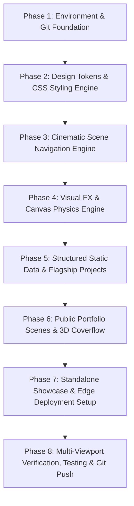

# 🗺️ Master Execution Plan: Nawyaj Morshed Portfolio

**Project Domain:** [nawyajmorshed.me](https://nawyajmorshed.me)  
**Target Repository:** [github.com/nawyajmorshed/my-portfolio](https://github.com/nawyajmorshed/my-portfolio)  
**Architecture:** 100% Pure Static, Git-driven, Global Edge Delivery (No Supabase)  
**Directive:** Zero shortcuts, complete architectural excellence, bespoke aesthetics, and full modularity.

---

## 📋 Execution Roadmap Overview

---

## Phase 1: Environment & Git Foundation Setup
- [x] Initialize Git repository in `c:\Users\dracu\Desktop\portfolio`.
- [x] Connect remote origin: `https://github.com/nawyajmorshed/my-portfolio.git`.
- [x] Add `CNAME` file configured with `nawyajmorshed.me`.
- [x] Create `.gitignore`, `package.json`, and `wrangler.toml` for Cloudflare Pages.
- [x] Clean directory tree removing backend/Supabase clutter.

---

## Phase 2: Design Tokens & CSS Styling Engine
- [ ] Build core `assets/css/styles.css`:
  - Obsidian dark theme design tokens (`--background`, `--surface-container`, `--on-surface`).
  - Dynamic accent color variables (`--primary-container`, `--accent-rgb`).
  - Refractive liquid glassmorphism classes (`.liquid-glass-refractive`, `.liquid-glass-interactive`).
  - 3D perspective staging rules (`perspective: 1200px`, `transform-style: preserve-3d`).
  - Elastic accordion flex transition curves.
  - Micro-interaction keyframes, glow pulses, and custom scrollbar styling.
- [ ] Create `assets/js/tailwind-config.js`:
  - Extend Tailwind with custom font families (`Geist`, `Outfit`).
  - Tokenized color scales matching dark luxury aesthetics.
  - Custom border radii and gutter spacing tokens.

---

## Phase 3: Core Navigation & Cinematic Scene Engine
- [ ] Build `assets/js/scene-nav.js`:
  - Full-page 100vw × 100vh horizontal viewport paging (`#scene-viewport`, `#scene-track`).
  - Mouse wheel delta accumulator with inertia dampening (prevents multi-scene skipping).
  - Touch gesture recognition (vector angle and distance threshold calculation for natural mobile swiping).
  - Keyboard navigation (Arrow keys, Home, End, PageUp, PageDown).
  - Dynamic URL hash synchronization (`#hero`, `#about`, `#work`, etc.).
- [ ] Build `assets/js/nav.js` and `assets/js/liquid-metal.js`:
  - Fixed rounded navbar with glassmorphism and WebGL liquid-metal shader border.
  - Animated indicator glider (`#nav-indicator`) smoothly sliding under active navigation links.
  - "Contact Me" / "Get In Touch" high-contrast CTA button with bounce feedback.
- [ ] Build `assets/js/scene-animations.js`:
  - GSAP 3.12 timeline triggers for coordinated element entrances upon arriving at each scene.
  - Integration with `SceneTimers` to automatically pause off-screen animations.

---

## Phase 4: Visual FX & Canvas Physics Engine
- [ ] Build `assets/js/particles-bg.js`:
  - HTML5 Canvas 2D interactive particle constellation engine.
  - Mouse proximity repulsion, velocity dampening, and dynamic connecting lines.
  - Synchronous `localStorage` check to prevent layout or performance flashes on low-power devices.
  - Dynamic color synchronization with active theme accent (`--accent-rgb`).
- [ ] Build `assets/js/ambient-glow.js`:
  - Real-time radial ambient cursor glow following pointer movement.
- [ ] Build `assets/js/preloader.js`:
  - Staggered typography entrance animation with blur reveal and smooth fade-out.
- [ ] Build Background Switcher UI:
  - Top-right floating circular icon button with dropdown switcher.
  - Toggle between canvas particle physics, custom video backgrounds, and ambient static wallpapers.

---

## Phase 5: Structured Static Data Engine (`assets/js/render-content.js`)
- [ ] Embed the 6 verified flagship projects:
  1. **Ever Green (`com.evergreen.health`)**: Production telemedicine mobile platform (Flutter, Dart, Riverpod, WebRTC/Agora calls, SQLCipher, SPKI cert pinning).
  2. **Ever Green Website**: Production healthcare marketing & booking platform (Next.js 16 App Router, TypeScript, Tailwind CSS v4, bilingual English ⇄ বাংলা).
  3. **CampusOne & FixIt**: BUBT Capstone Android companion app + React web app with maintenance reporting, lost & found, P2P student marketplace, rides, blood donations.
  4. **Tahbil**: Offline-first receipt-scanning expense tracker (Flutter, Dart, Riverpod, Drift SQLite, Google ML Kit OCR).
  5. **Havzero**: AI fine-tuning & LLM system (Python, Unsloth, Cloudflare Tunnels).
  6. **3D Racing Simulator**: Open-world 3D game with Modern OpenGL 3.3+, GLSL shaders, chunk streaming, and custom vehicle physics.
- [ ] Embed categorized skills:
  - Mobile Engineering (Flutter, Dart, Android SDK, Riverpod, SQLite/Drift, ML Kit).
  - Full-Stack & Web (Next.js 16, React, TypeScript, Node.js, Tailwind CSS, PostgreSQL, Supabase).
  - AI & Machine Learning (Python, Unsloth, LLM Fine-Tuning, PyTorch, Cloudflare Tunnels).
  - Graphics & Systems (PyOpenGL, Modern OpenGL 3.3+, GLSL Shaders, Pygame, NumPy).
- [ ] Embed personal details & education:
  - Full Name: Nawyaj Morshed
  - Education: B.Sc. in Computer Science & Engineering (CSE) at Bangladesh University of Business & Technology (BUBT).
  - Location: Dhaka, Bangladesh
  - Email: `nawyajmorshed2000@gmail.com`
  - GitHub: `https://github.com/nawyajmorshed`

---

## Phase 6: Public Portfolio Scenes (`index.html`)
- [ ] **Scene 1: Hero (`#hero`)**
  - "Available for Opportunities" status badge with pulse glow.
  - Impact headline with dynamic highlighted span.
  - Engaging bio paragraph showcasing Full-Stack, Mobile, AI, and 3D graphics expertise.
  - "Download Resume" CTA button and "Browse Apps" button.
  - Floating avatar frame with refractive glass border and ambient back-glow.
  - Social media icon cluster (GitHub, LinkedIn, Email).
- [ ] **Scene 2: About (`#about`)**
  - Professional narrative and background story at BUBT.
  - 2-column balanced personal details cards (Full Name, Location, Degree, Availability, etc.).
- [ ] **Scene 3: Work / Projects (`#work`)**
  - Category filter tabs with animated glider pill ("All Projects", "Mobile Apps", "Web & AI", "3D Graphics").
  - 3D Coverflow slider engine (mathematical perspective transforms, autoplay, drag/swipe, modal expanders).
- [ ] **Scene 4: Skills (`#skills`)**
  - Categorized skill cards with icons and tags.
  - Fixed bottom marquee band (`#floating-chips`) with continuous infinite drift.
- [ ] **Scene 5: Experience & Education (`#experience`)**
  - Elastic accordion gallery expanding smoothly on hover or tap.
  - Roles, milestones, Capstone accomplishments, and tech badges.
- [ ] **Scene 6: Testimonials / Recommendations (`#testimonials`)**
  - Multi-tab coverflow carousel for project feedback and peer recommendations.
- [ ] **Scene 7: Contact & Integrated Footer (`#contact`)**
  - Refractive contact container.
  - Interactive 4-color Gmail hover CTA button with SVG contour patterns and expanding radial gradient.
  - Direct email trigger to `nawyajmorshed2000@gmail.com`.
  - Integrated footer with back-to-top button and copyright notice: `© 2026 Nawyaj Morshed.`

---

## Phase 7: Standalone Showcase & Edge Deployment Setup
- [ ] Build `apps.html` and `assets/js/apps-page.js` for standalone APK/web application showcase.
- [ ] Configure `wrangler.toml` for Cloudflare Pages edge deployment.
- [ ] Configure SEO meta tags, OpenGraph cards, Twitter preview cards, and favicons with Nawyaj's branding.

---

## Phase 8: Multi-Viewport Verification, Testing & Git Push
- [ ] Launch local HTTP server and perform end-to-end verification.
- [ ] Verify 60fps animations, wheel inertia, touch swipe on mobile viewports.
- [ ] Verify theme customizer and background switcher.
- [ ] Commit all completed files with clear atomic Git history.
- [ ] Push to `https://github.com/nawyajmorshed/my-portfolio.git`.
